# 📱 Pratyaksh - No Touch, No Cards, Just You

**A smart, automated attendance management system powered by facial recognition and GPS geofencing.**

Pratyaksh revolutionizes traditional attendance tracking by eliminating manual processes and introducing touchless, AI-powered verification. Built for modern educational institutions, it ensures accuracy, transparency, and efficiency in attendance management.

## 🌟 Overview

Pratyaksh addresses critical gaps in current attendance management systems:
- **Time-Consuming Processes**: Automating manual roll calls and data entry
- **Proxy Attendance**: Virtually eliminating fraudulent attendance through biometric verification
- **Data Management**: Handling large volumes of attendance data efficiently
- **Lack of Verification**: Smart validation using AI and location services
- **Transparency Issues**: Real-time sync and accessible attendance records

## ✨ Key Features

### 🤖 AI-Powered Face Recognition
- **Touchless Verification**: No physical contact required for attendance
- **Advanced Detection**: Google ML Kit Face Detection + TensorFlow Lite
- **Face Embeddings**: Secure storage and matching of facial data
- **Adaptive Learning**: Continuous dataset updates for improved accuracy
- **Lighting Adaptability**: Works in various lighting conditions with proper guidance

### 📍 GPS Geofencing
- **Location Verification**: Ensures students are physically present on campus
- **Geofence Zones**: Dynamic boundary creation for different campus areas
- **Mock Location Detection**: Advanced GPS spoofing prevention
- **Wi-Fi/Bluetooth Validation**: Multi-layer location verification
- **Restricted Check-in**: Attendance marking only within authorized zones

### ⏱️ Real-Time Synchronization
- **Instant Updates**: Attendance reflected immediately across all devices
- **Cloud Integration**: Firebase Firestore for seamless data sync
- **Offline Support**: Local data capture with auto-sync when connected
- **Conflict Resolution**: Smart handling of network interruptions

### 👥 Multi-Role Access
- **Students**: Mark attendance, view records, check schedules
- **Teachers**: Monitor real-time attendance, manual overrides, generate reports
- **Administrators**: Manage users, timetables, system configuration

### 📊 Smart Analytics & Reporting
- **Digital Reports**: Automated PDF generation with comprehensive data
- **Visual Dashboards**: Interactive charts and graphs for attendance trends
- **Data Export**: CSV/Excel export for external analysis
- **Custom Filters**: Advanced filtering by date, subject, department

### 🗓️ Dynamic Timetable Management
- **Flexible Scheduling**: Support for changing timetables and special classes
- **Period Activation**: Automatic period detection based on time
- **Conflict Detection**: Alerts for timetable mismatches
- **Multi-Department Support**: Scalable for complex institutional structures

## 🎯 Mission & Impact

Pratyaksh contributes to **UN Sustainable Development Goals**:

- **SDG 4 - Quality Education**: Promoting efficient learning time management
- **SDG 9 - Industry, Innovation & Infrastructure**: Building smart institutional infrastructure
- **SDG 16 - Peace, Justice & Strong Institutions**: Ensuring transparent and accountable systems

## 🛠️ Tech Stack

### Frontend Framework
- **Framework**: Flutter SDK
- **Language**: Dart
- **IDE**: Android Studio / VS Code
- **UI Libraries**: Material Design Components
- **Typography**: Custom brand styling
- **Icons**: Scalable vector iconography

### State Management
- **Architecture**: Provider / Bloc pattern
- **Persistence**: SharedPreferences for local storage
- **Communication**: EventBus for component messaging
- **Data Flow**: Reactive state management

### Backend & Database
- **Backend as a Service**: Firebase
- **Database**: Cloud Firestore
  - Users collection (all roles)
  - Timetable (daily period data)
  - Attendance (logs with GPS & face data)
  - Active Days (admin controls)
- **Authentication**: Firebase Authentication
- **Storage**: Firebase Storage for face embeddings

### AI & Machine Learning
- **Face Detection**: Google ML Kit Face Detection
- **Face Recognition**: TensorFlow Lite models
- **Model Training**: Custom face embedding algorithms
- **Data Processing**: On-device ML for privacy

### Location Services
- **GPS Tracking**: geolocator package
- **Geofencing**: geofence_service
- **Location Validation**: Mock location detection
- **Multi-layer Verification**: GPS + Wi-Fi + Bluetooth

### Data Visualization & Reports
- **Charts**: Interactive data visualization libraries
- **PDF Generation**: Digital report creation
- **Data Export**: CSV/Excel generation
- **Analytics**: Custom filtering and sorting toolkit

### Testing & Deployment
- **Development**: Flutter Debug & Profile Modes
- **Testing**: Widget, Integration, and Unit tests
- **Deployment**: Android APK Release
- **Monitoring**: Firebase Console for analytics and crash reporting

## 📱 App Demonstration

### Common Screens (All Roles)

#### 1. Splash Screen
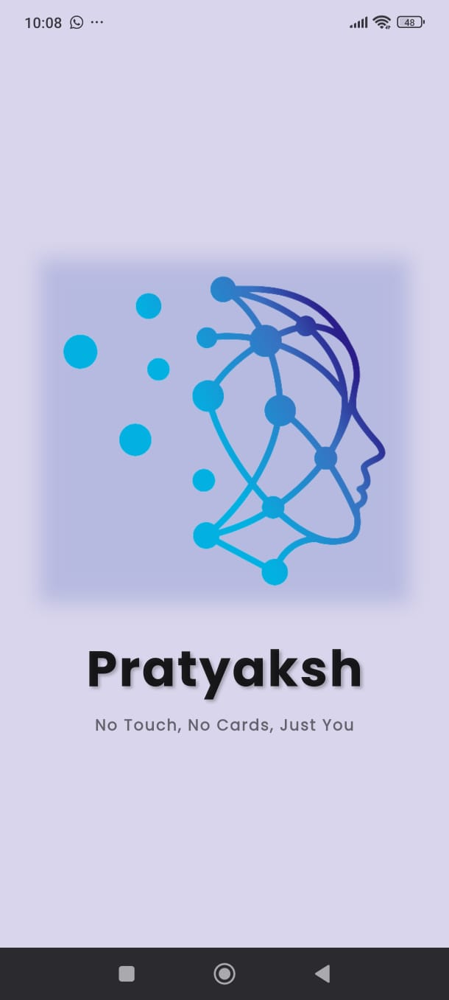

---

#### 2. Login Screen
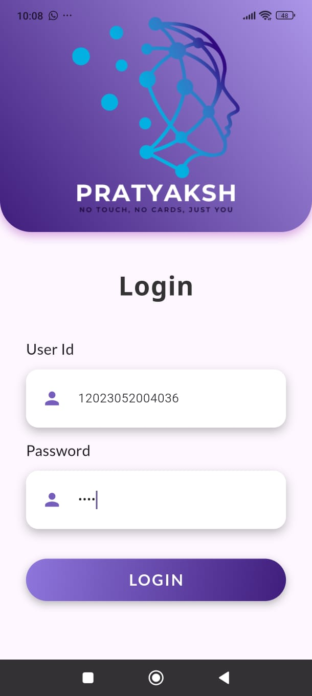

**Secure Authentication:**
- User ID field (12-digit enrollment number)
- Password field with hidden input
- Purple theme consistent with app branding
- Automatic role-based routing after login
- Validates credentials against Firebase

---

### 👨‍🎓 Student Dashboard

#### 3. Timetable View
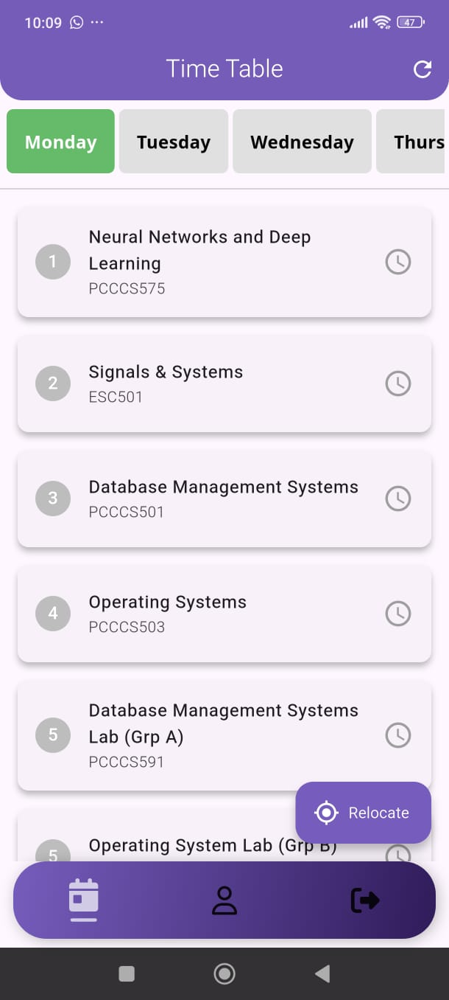

**Daily Class Schedule:**
- Day-wise tabs (Monday to Friday shown)
- Period-wise subject listing with codes
- Clock icons indicate scheduled periods
- "Relocate" button for GPS-based attendance
- Bottom navigation: Calendar, Profile, Logout

---

#### 4. Timetable with Active Period
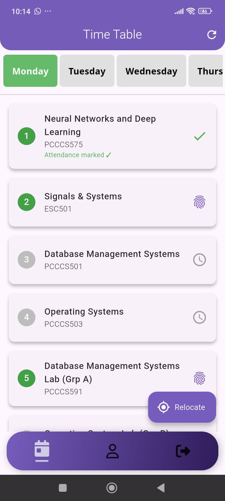

**Periods Activated highlighted with green:**
- Fingerprint icon indicates attendance can be marked
- System detects current period based on time
- GPS verification ready for this class
- Only active periods allow attendance marking

---

#### 5. Attendance Success Dialog
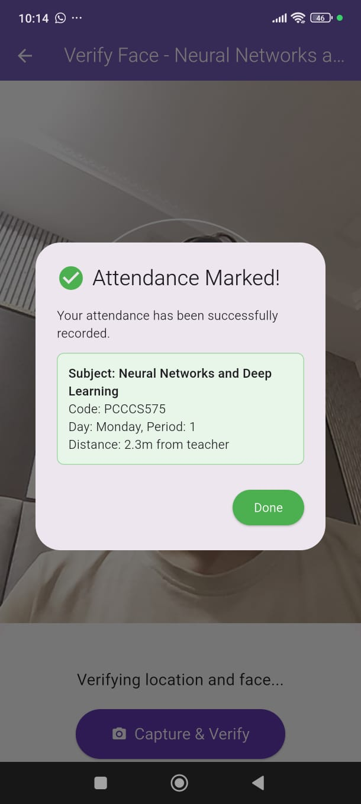

**Confirmation Screen:**
- ✅ "Attendance Marked!" with success message
- Subject details in green box:
  - Neural Networks and Deep Learning (PCCCS575)
  - Day: Monday, Period: 1
  - Distance: 2.3m from teacher (GPS verification)
- "Capture & Verify" button for face recognition

---

#### 6. Post-Attendance Timetable


**Attendance Status:**
- Period 1: Green checkmark - "Attendance marked ✓"
- Period 2: Fingerprint icon - Ready for marking
- Period 5: Fingerprint icon - Lab session active
- Teachers can view which periods have attendance completed
- Quick access to mark remaining periods

#### 7. Student Profile with Analytics
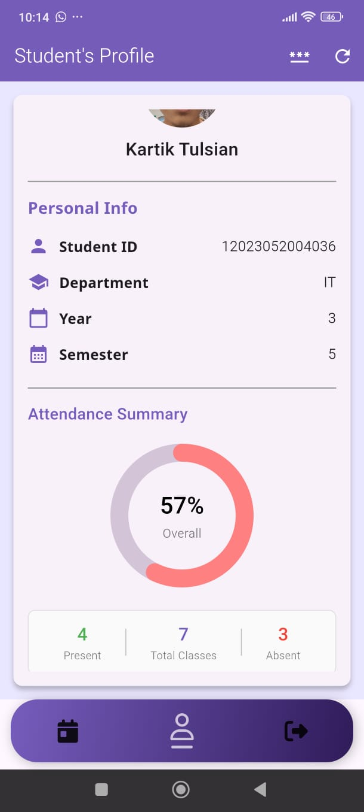

**Comprehensive Student Data:**
- Attendance Summary: 57% overall with visual donut chart
- Statistics breakdown
- Password change option (three dots menu)

---
### 👨‍🏫 Teacher Dashboard

#### 8. GPS Location Ready
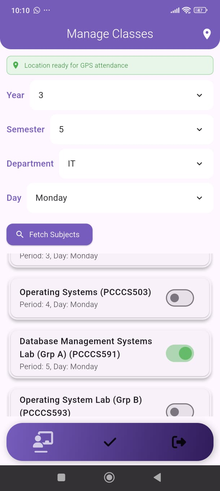

**Location Verification:**
- Green banner: "Location ready for GPS attendance"
- Confirms student is within campus geofence
- Displays selected filters (Year 3, Semester 5, IT, Monday)
- "Fetch Subjects" button to load today's classes
- Toggle switches show enabled/disabled periods
- 
#### 9. Student Attendance View
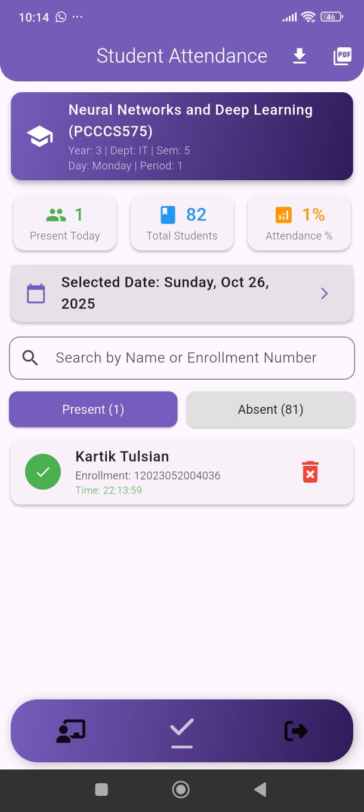

**Class Attendance Details:**
- Statistics and details
- Date selector for historical data
- Search by name or enrollment number
- Present/Absent tabs with counts
- Delete option for corrections

---

### 👨‍💼 Admin Dashboard

#### 10. Manage Classes - Timetable Setup
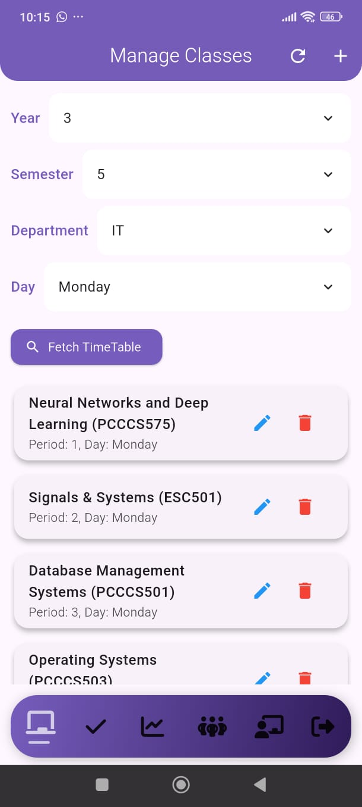

**Admin Timetable Configuration:**
- "Fetch TimeTable" button to load schedule
- Listed subjects with edit/delete icons
- Refresh and add new subject buttons
- Bottom nav: Manage Classes, Attendance, Analytics, Students, Teachers, Logout

---

#### 11. Edit Period Details
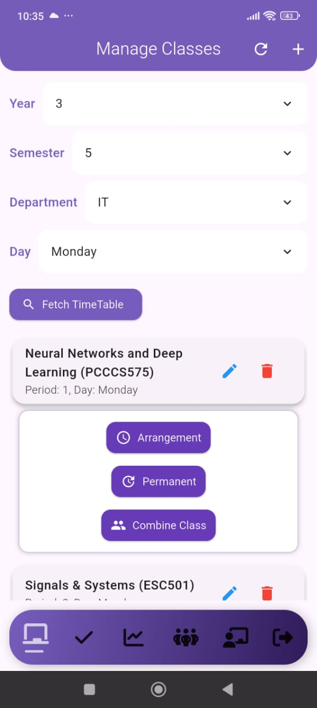
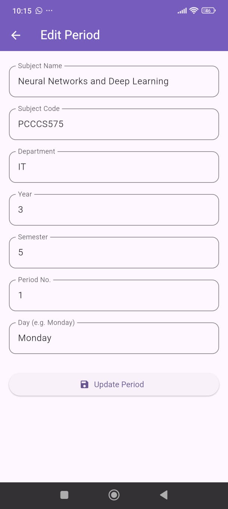

**Period Modification Form:**
- Do the changes for Arrangement/Permanent/Combine Classes
- Editable fields
- "Update Period" button to save changes
- Admin can modify any subject details

---

#### 12. Live Attendance Monitor
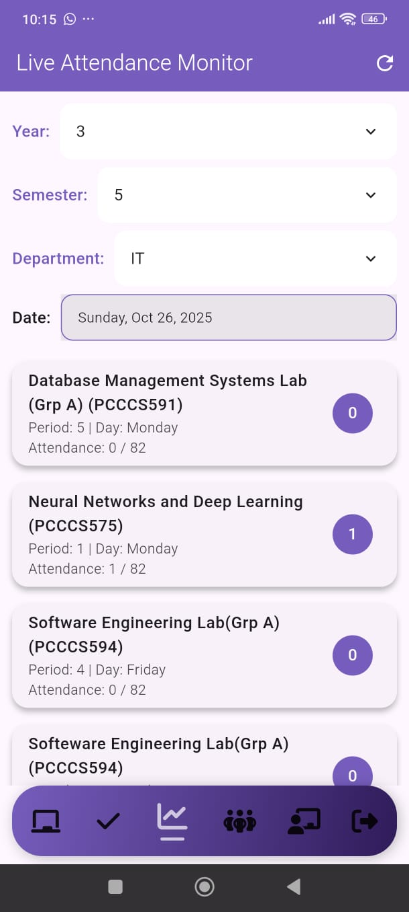

**Real-Time Attendance Tracking:**
- Filter by Year, Semester, Department
- Date: Sunday, Oct 26, 2025
- Live attendance cards showing
- Purple badges show current attendance count
- Monitors all ongoing classes simultaneously

---

#### 13. All Students List
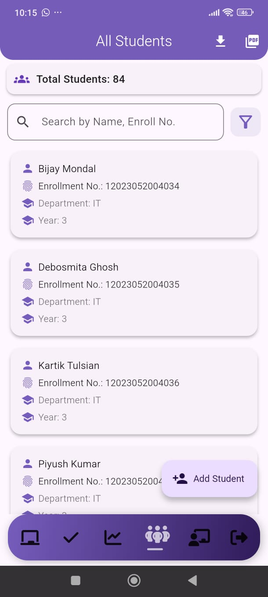

**Student Database:**
- Search by name or enrollment number
- Filter icon for advanced searches
- Student cards
- "Add Student" floating button
- Download and PDF export options

---

#### 14. All Teachers List
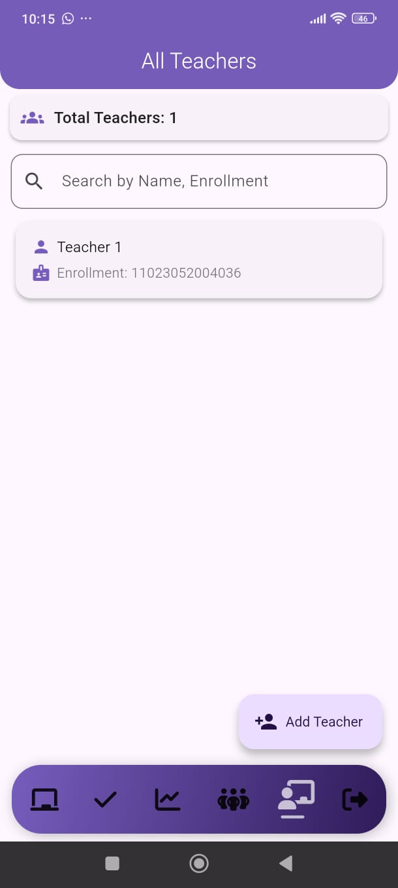

**Faculty Management:**
- Search by name or enrollment
- "Add Teacher" floating button for new faculty
- Simple, clean interface for teacher administration
- Access from admin bottom navigation

---

## 🚀 Getting Started

### Prerequisites
- Flutter SDK (3.0 or higher)
- Dart SDK (3.0 or higher)
- Android Studio / VS Code with Flutter plugin
- Firebase account
- Android device/emulator (API level 21+)

### Installation

1. **Clone the repository**
```bash
git clone https://github.com/your-username/pratyaksh.git
cd pratyaksh
```

2. **Install dependencies**
```bash
flutter pub get
```

3. **Firebase Setup**

Create a new Firebase project at [Firebase Console](https://console.firebase.google.com/)

Download `google-services.json` and place it in:
```
android/app/google-services.json
```

4. **Configure Firebase Services**

Enable the following in Firebase Console:
- Authentication (Email/Password, Google Sign-In)
- Cloud Firestore
- Firebase Storage
- Firebase Analytics

5. **Set up environment variables**

Create a `.env` file in the root directory:
```env
# Firebase Configuration
FIREBASE_API_KEY=your_api_key
FIREBASE_APP_ID=your_app_id
FIREBASE_MESSAGING_SENDER_ID=your_sender_id
FIREBASE_PROJECT_ID=your_project_id
FIREBASE_STORAGE_BUCKET=your_storage_bucket

# ML Models
FACE_DETECTION_MODEL=path_to_model
FACE_RECOGNITION_THRESHOLD=0.85

6. **Download ML Models**

Place TensorFlow Lite models in:
```
assets/models/
├── face_detection.tflite
└── face_recognition.tflite
```

7. **Run the app**
```bash
# Debug mode
flutter run

# Release mode
flutter run --release

# Specific device
flutter run -d <device_id>
```

## 📁 Project Structure
```
pratyaksh/
├── lib/
│   ├── splash_screen.dart        # Splash screen
│   ├── main.dart                 # App entry point
│   ├── models/                   # Data models
│   │   ├── app_user_model.dart
│   │   ├── attendance_model.dart
│   │   ├── subject_model.dart
│   │   ├── teacher_model.dart
│   │   └── student_model.dart
│   ├── screens/                  # UI screens
│   │   ├── auth/                # Authentication screens
│   │   ├── student/             # Student dashboard
│   │   ├── teacher/             # Teacher dashboard
│   │   └── admin/               # Admin dashboard
│   ├── widgets/                  # Reusable widgets
│   │   ├── attendance_card.dart
│   │   ├── face_capture.dart
│   │   ├── location_widget.dart
│   │   ├── create_period.dart
│   │   ├── create_student.dart
│   │   ├── create_teacher.dart
│   │   ├── day_selector.dart
│   │   ├── face_attendance_screen.dart
│   │   ├── face_registration.dart
│   │   ├── subject_card.dart
│   │   ├── update_password.dart
│   │   ├── update_period.dart
│   │   ├── update_student.dart
│   │   └── update_teacher.dart
│   ├── services/                 # Business logic
│   │   ├── auth_service.dart
│   │   ├── attendance_service.dart
│   │   ├── database_service.dart
│   │   ├── embedding_manager_service.dart
│   │   ├── face_embedding_service.dart
│   │   ├── face_recognition_service.dart
│   │   └── firestore_service.dart
├── assets/
│   ├── models/                   # ML models
│   └── google_fonts/
├── android/                      # Android-specific files
├── ios/                          # iOS-specific files (future)
├── test/                         # Unit & widget tests
└── pubspec.yaml                  # Dependencies
```

## 🔧 Available Commands
```bash
# Run in debug mode
flutter run

# Run in profile mode (performance testing)
flutter run --profile

# Build APK
flutter build apk --release

# Build App Bundle
flutter build appbundle --release

# Run tests
flutter test

# Run tests with coverage
flutter test --coverage

# Analyze code
flutter analyze

# Format code
flutter format .

# Clean build files
flutter clean

# Check device/emulator list
flutter devices

# Generate icons
flutter pub run flutter_launcher_icons:main

# Check outdated packages
flutter pub outdated
```

## 🧪 Testing

### Run Unit Tests
```bash
flutter test test/unit/
```

### Run Widget Tests
```bash
flutter test test/widget/
```

### Run Integration Tests
```bash
flutter test test/integration/
```

### Generate Coverage Report
```bash
flutter test --coverage
genhtml coverage/lcov.info -o coverage/html
open coverage/html/index.html
```

## 📱 Features by User Role

### 👨‍🎓 Student Features
- Face-based attendance marking
- View personal attendance records
- Access timetable and schedule
- Receive attendance notifications
- View attendance percentage with visual charts
- GPS-verified location attendance
- Real-time period activation

### 👨‍🏫 Teacher Features
- Monitor real-time class attendance
- View student-wise attendance
- Generate class-wise reports
- View attendance statistics (present/absent/percentage)
- Manual attendance corrections
- Export attendance data
- Search students by name or enrollment

### 👨‍💼 Admin Features
- Manage users (students, teachers)
- Configure and edit timetables
- Set up geofence boundaries
- System-wide analytics dashboard
- Control active attendance days
- Live attendance monitoring
- Bulk operations support
- Student profile management with attendance analytics
- Teacher management
- Period creation and modification

## 🛡️ Security & Privacy

### Data Protection
- **Face Embeddings**: Encrypted storage in Firebase
- **Secure Communication**: HTTPS for all API calls
- **Access Control**: Role-based permissions
- **Data Minimization**: Only essential data collected
- **GDPR Compliance**: User data deletion capabilities

### Privacy Measures
- Face data stored as mathematical embeddings, not images
- Location data used only during attendance window
- No tracking outside designated areas
- Transparent data usage policies
- User consent for biometric data

## 🔧 Risk Mitigation

### Face Recognition Challenges
- **Solution**: Advanced ML models with user positioning guidance
- **Fallback**: Manual override by teacher
- **Continuous Improvement**: Regular dataset updates

### GPS Spoofing
- **Solution**: Mock location detection
- **Multi-layer Verification**: Wi-Fi + Bluetooth validation
- **Restricted Zones**: Geofenced attendance areas

### Battery Optimization
- **Solution**: Low-power ML models
- **Limited Usage**: Location tracking only during attendance window
- **User Guidance**: Power consumption tips

### Offline Functionality
- **Solution**: Local data capture with auto-sync
- **Cached Timetable**: Offline access to schedules
- **Queue System**: Pending uploads when online

### Device Compatibility
- **Solution**: Adaptive ML models for different devices
- **Minimum Requirements**: API level 21+ (Android 5.0+)
- **Fallback Options**: Teacher-approved manual attendance

## 🎨 UI/UX Features

- **Material Design**: Modern, intuitive interface with purple theme
- **Brand Styling**: Custom typography and color schemes
- **Adaptive Layouts**: Responsive design for various screen sizes
- **Visual Feedback**: Green/purple indicators for status
- **Accessibility**: Clear icons and readable text
- **Smooth Animations**: Fluid transitions between screens

## 📊 Performance Optimization

- **Lazy Loading**: Efficient data fetching
- **Image Optimization**: Compressed face data storage
- **Caching Strategy**: Local storage for frequent data
- **Background Processing**: Non-blocking operations
- **Memory Management**: Efficient resource utilization

## 🌐 Future Enhancements

- 📱 iOS app development
- 🌐 Web dashboard for administrators
- 🔔 Push notifications for attendance alerts
- 📊 Advanced analytics with AI insights
- 🗣️ Voice-based attendance commands
- 🌍 Multi-language support
- 🎓 Integration with Learning Management Systems
- 📧 Email reports for parents
- 🔗 API for third-party integrations
- 📸 Improved low-light face recognition
- 🎯 Attendance prediction using ML

## 👥 Team

**Developed by IEM Software Engineering Lab (PCCCS594)**

- **Kartik Tulsian** (12023052004036) - Solution Architect & UI/UX Designer

**Mentored by:**
- Prof. Subhabrata Sengupta
- Prof. Dr. Rupayan Das

**Institution:** Department of Information Technology, Institute of Engineering and Management

## 📄 License

This project is part of an academic curriculum at IEM and is subject to institutional guidelines. For commercial use or licensing inquiries, please contact the team.

## 🙏 Acknowledgments

- Flutter team for the amazing framework
- Firebase for backend services
- Google ML Kit for face detection
- TensorFlow for machine learning capabilities
- All contributors and testers
- IEM faculty for guidance and support

## 📚 Learn More

To learn more about the technologies used:

- [Flutter Documentation](https://docs.flutter.dev/) - Flutter features and widgets
- [Firebase Documentation](https://firebase.google.com/docs) - Backend services
- [ML Kit Documentation](https://developers.google.com/ml-kit) - Face detection
- [TensorFlow Lite](https://www.tensorflow.org/lite) - On-device ML
- [Dart Language](https://dart.dev/guides) - Programming language

## 🔗 Quick Links

- [Lab: Write your first Flutter app](https://docs.flutter.dev/get-started/codelab)
- [Cookbook: Useful Flutter samples](https://docs.flutter.dev/cookbook)
- [Flutter Widget Catalog](https://docs.flutter.dev/development/ui/widgets)
- [Flutter YouTube Channel](https://www.youtube.com/c/flutterdev)

---

**Made with 💙 for modern educational institutions**

*No Touch, No Cards, Just You - Redefining attendance management with AI and innovation.*